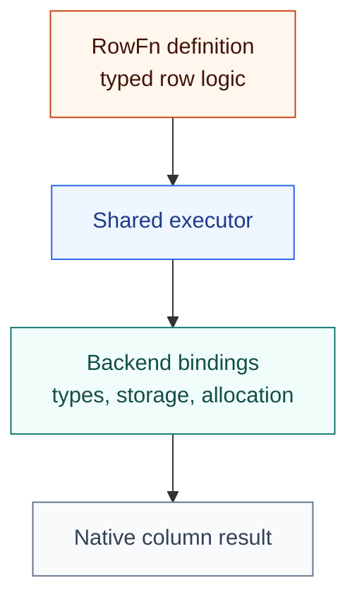

<!-- SPDX-License-Identifier: Apache-2.0 -->
<!-- SPDX-FileCopyrightText: Copyright the Vortex contributors -->

# RowFn

**Typed row functions for columnar systems.**

Define a row operation once and run it over columns. RowFn handles traversal, constants, nulls, and
error propagation. A backend supplies its native types, storage, allocation, and output construction.



The framework is independent of the backend. Arrow is the first backend included in this workspace.
Other integrations have yet to be added. An earlier Vortex prototype is preserved as a research
snapshot. See [backends](rowfn/BACKENDS.md) for the current scope.

## Start here

| Read | For |
| --- | --- |
| [Architecture](rowfn/ARCHITECTURE.md). | Components and execution flow. |
| [Rust interfaces](rowfn/INTERFACES.md). | Actual traits and types. |
| [Write a function](rowfn/AUTHORING.md). | Callbacks, preparation, errors, and sinks. |
| [Add a backend](rowfn/ADAPTERS.md). | Type and storage bindings. |
| [Benchmarks](BENCHMARKS.md). | Recorded results and measurement limits. |

## Try an example

The included example uses the Arrow backend:

```sh
cargo run --locked -p rowfn-functions --features arrow --example arrow
```

It performs checked addition and writes owned string output. The function definitions remain
backend-independent.

## Status

The crates are experimental and unpublished to crates.io. Null inputs imply null output, and valid
inputs cannot produce null. Whole-batch functions and custom null behavior can use other interfaces.

The latest package split, text dispatch, rename, and export have source review only. Historical
measurements cover earlier code and do not establish current performance. See the
[comparison guide](rowfn/COMPARING.md) and [safety record](rowfn/SAFETY.md) for details.
