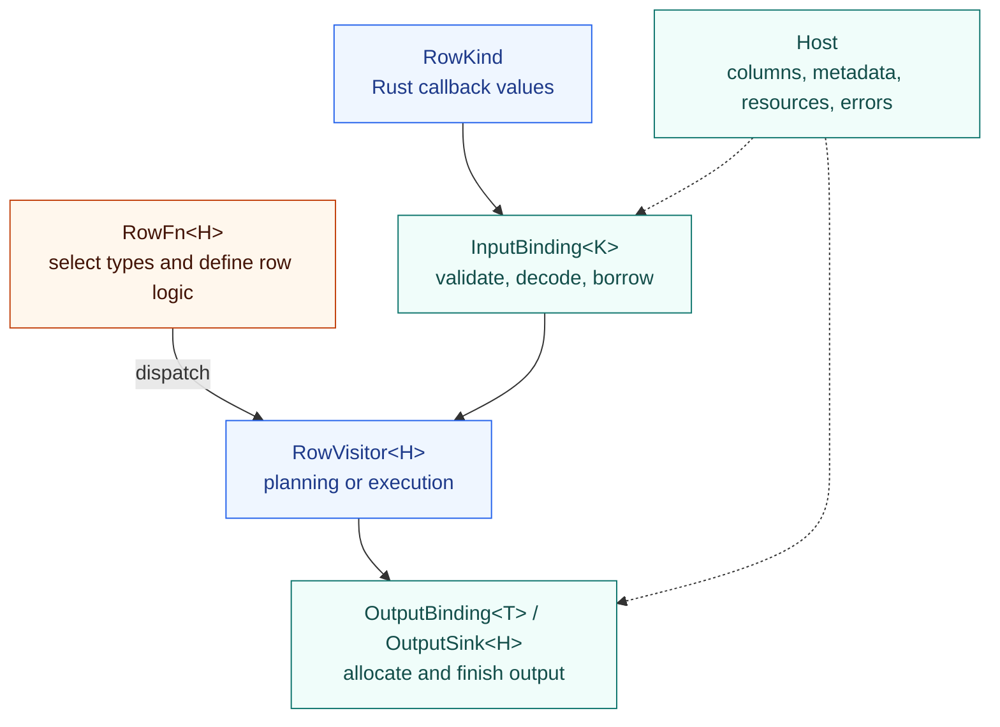

<!-- SPDX-License-Identifier: Apache-2.0 -->
<!-- SPDX-FileCopyrightText: Copyright the Vortex contributors -->

# RowFn

RowFn turns a typed Rust computation for one row into an operation on columns. The function author
defines the inputs and the calculation. The framework handles type validation, batch decoding,
constants, null propagation, traversal, and output construction.

A calculation such as addition or distance can be a few lines of row logic, but a columnar kernel
also needs to handle arrays, scalar arguments, nulls, and output storage. RowFn shares that surrounding
work across functions. Authors can reuse a function across backends while each backend retains its
native types, buffers, and allocation.

The row callback runs inside typed column traversal. Values remain in columnar storage, and the
compiler sees concrete input and output types. A backend adapter connects those loops to its arrays
or scalar-function interface.

## A row operation

Inside `RowFn::dispatch`, this visit defines signed 64-bit wrapping addition:

```rust,ignore
visitor.visit::<(i64, i64), i64>(|(lhs, rhs)| lhs.wrapping_add(rhs))
```

The same visit supplies the signature for planning and the callback for execution. RowFn combines
input validity, handles scalar operands, and builds the result column. The author does not write an
array loop or a null check.

<details>
<summary>Complete function definition</summary>

```rust
use rowfn::HostResult;
use rowfn::InputBinding;
use rowfn::OutputBinding;
use rowfn::RowFn;
use rowfn::RowVisitor;

#[derive(Clone)]
struct WrappingAdd;

impl<H> RowFn<H> for WrappingAdd
where
    H: InputBinding<i64> + OutputBinding<i64>,
{
    type Options = ();
    const ARG_NAMES: &'static [&'static str] = &["lhs", "rhs"];
    const INFALLIBLE: bool = true;

    fn dispatch<V: RowVisitor<H>>(
        &self,
        _: &(),
        _: &[H::NativeType],
        visitor: V,
    ) -> HostResult<H, V::VisitResult> {
        visitor.visit::<(i64, i64), i64>(|(lhs, rhs)| lhs.wrapping_add(rhs))
    }
}
```

The backend supplies the `i64` bindings. The function contains no Arrow, DataFusion, or Vortex types.
The [author guide](rowfn/AUTHORING.md) covers preparation, checked arithmetic, and owned strings.

</details>

## The traits



`RowVisitor` has separate planning and execution implementations. Bindings retain decoded owners
while callbacks borrow their values. [Architecture](rowfn/ARCHITECTURE.md) explains the execution
flow, and [Rust interfaces](rowfn/INTERFACES.md) shows the full contracts.

## Use it with Arrow or DataFusion

[`rowfn-arrow`](rowfn-arrow/README.md) invokes functions directly on Arrow arrays.
[`rowfn-datafusion`](rowfn-datafusion/README.md) exposes the same definitions as DataFusion scalar
UDFs through its existing registration interface. It delegates execution to the Arrow backend.

The examples use checked integer addition and Unicode trimming. The SQL example also adjusts
timestamp ticks and calls a nullary function:

```sh
cargo run --locked -p rowfn-functions --features arrow --example arrow
cargo run --locked -p rowfn-datafusion --example sql
```

Null inputs imply null output, and valid inputs cannot produce null. Functions that need custom null
behavior or a whole-batch algorithm can use their engine's broader function interface. Whether a row
kernel is faster than a native kernel depends on the operation, backend, and compiler.

## Documentation

| Read | For |
| --- | --- |
| [Write a function](rowfn/AUTHORING.md) | Callbacks, preparation, errors, and sinks. |
| [Architecture](rowfn/ARCHITECTURE.md) | Components and execution flow. |
| [Rust interfaces](rowfn/INTERFACES.md) | Traits, associated types, and signatures. |
| [Add a backend](rowfn/ADAPTERS.md) | Type, storage, and ownership bindings. |
| [Backends](rowfn/BACKENDS.md) | Included integrations and remaining work. |
| [Compare implementations](rowfn/COMPARING.md) | Matched semantics and benchmark boundaries. |
| [Measurements](BENCHMARKS.md) | Historical results and their source revisions. |
| [Status and verification](STATUS.md) | What is implemented and what has run. |

## Status

The Rust API is experimental, and the crates are unpublished to crates.io. The standalone workspace
and DataFusion integration have source review and dependency resolution only. Historical timings
describe earlier revisions. See [status and verification](STATUS.md) before relying on those results.

The project grew out of Vortex's [row-oriented scalar function work](https://github.com/vortex-data/vortex/issues/9128)
and [RowFn API design](https://github.com/vortex-data/vortex/issues/9129). This repository explores
that authoring model with backend-independent contracts. The earlier Vortex adapter remains in a
[reconstruction snapshot](integrations/vortex/README.md) outside the active workspace.
