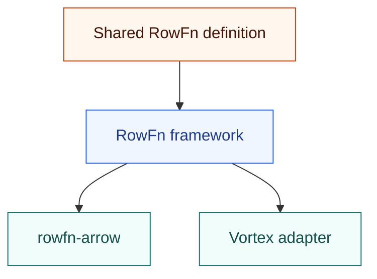

<!-- SPDX-License-Identifier: Apache-2.0 -->
<!-- SPDX-FileCopyrightText: Copyright the Vortex contributors -->

# RowFn

**Typed row functions, executed on columnar arrays.**

One function definition runs through Arrow or Vortex bindings. Each host keeps its own storage,
allocation, validity, and output metadata.



For Arrow maintainers, the experiment offers another implementation of selected kernels to compare
and investigate. Historical runs contain both wins and losses. It is not an upstream adoption proposal.

## Explore

| Read | To understand |
| --- | --- |
| [Architecture](rowfn/ARCHITECTURE.md). | How types, visitors, execution, and bindings fit together. |
| [Rust interfaces](rowfn/INTERFACES.md). | The actual traits, methods, and concrete host types. |
| [Backends](rowfn/BACKENDS.md). | Implemented Arrow/Vortex bindings and potential DataFusion/DuckDB integrations. |
| [Arrow example](rowfn-functions/examples/arrow.rs). | Checked addition and owned string output. |
| [Kernel comparisons](rowfn/COMPARING.md). | Matched semantics, measurement boundaries, and recorded results. |

## Try the example

From this checkout:

```sh
cargo run --locked -p rowfn-functions --features arrow --example arrow
```

The workspace and Arrow fixtures have no Vortex dependency. The Vortex adapter, full cross-host
fixtures, and matching patch are preserved under [integrations/vortex](integrations/vortex/README.md).

## Status

The crates are experimental and remain unpublished to crates.io. Null inputs imply null output, and valid inputs cannot
produce null. Whole-batch functions and custom null behavior can use other interfaces.

The reports cover Arrow 59.3.0 and earlier code. The package split, text dispatch, rename, and
standalone export remain unbuilt, untested, and unbenchmarked. See the
[comparison guide](rowfn/COMPARING.md) for measurement limits and the
[safety record](rowfn/SAFETY.md) for unsafe contracts.
