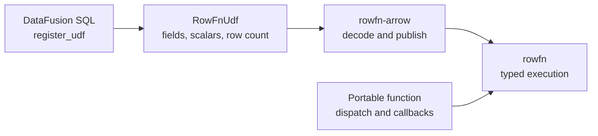

<!-- SPDX-License-Identifier: Apache-2.0 -->
<!-- SPDX-FileCopyrightText: Copyright the Vortex contributors -->

# DataFusion integration

[Overview](../README.md) · [Arrow backend](../rowfn-arrow/README.md) · [Status](../STATUS.md)

`RowFnUdf` exposes a strict RowFn definition through DataFusion's scalar UDF interface. It delegates
planning and execution to `rowfn-arrow`, so the portable function retains its type dispatch and row
operations. Registration uses DataFusion's existing scalar UDF interface.



## Register and call

Any `RowFn<ArrowHost>` whose options are `Send + Sync + 'static` can use this wrapper. For example,
register the shared checked-addition definition:

```rust,ignore
use datafusion::prelude::SessionContext;
use datafusion_expr::ScalarUDF;
use datafusion_expr::Volatility;
use rowfn_datafusion::RowFnUdf;
use rowfn_functions::Add;
use rowfn_functions::NoOptions;

let context = SessionContext::new();
let udf = RowFnUdf::new("rowfn_add", Add::<true>, NoOptions, Volatility::Immutable)?;
context.register_udf(ScalarUDF::from(udf));
```

Enable `rowfn-functions`' `arrow` feature for its Arrow mappings. The [complete example](examples/sql.rs)
registers checked addition, Unicode trimming, timestamp tick adjustment, and a nullary function:

```sql
SELECT rowfn_add(CAST(value AS SMALLINT), CAST(2 AS SMALLINT)),
       rowfn_add(CAST(value AS BIGINT), CAST(40 AS BIGINT)),
       rowfn_trim(text),
       rowfn_adjust_ticks(CAST('2026-10-07 12:00:00' AS TIMESTAMP), CAST(value AS BIGINT))
FROM (VALUES (1, '  hello  '), (2, '  world  ')) AS input(value, text);
```

The same addition definition selects signed or unsigned widths at runtime. The signature checks
arity and retains input types unchanged. The shared Arrow planner rejects unsupported types,
mismatched operands, and unknown extensions. Explicit casts resolve differing widths and untyped
null literals. Tick adjustment adds ticks in the timestamp's existing unit without timezone conversion.

## Invocation contract

DataFusion scalars become one-row `ArrowOperand` values with `scalar: true`. Array operands retain
`scalar: false`, including length-one arrays. Every Arrow invocation receives `number_rows` and the
complete input and result fields. Planned nullability comes from fields, not current batch values.
Semantic output labels retain their metadata, including timestamp units and timezones.

Nonempty calls with only scalar arguments return a DataFusion scalar after Arrow publication.
Arrow still receives the actual logical row count, including the allocation needed to broadcast
valid scalar results. Empty and nullary calls return arrays with exactly that row count. Zero-row
calls skip row callbacks. Preparation and invocation validation can still run for an empty batch.

Null inputs imply null output, and valid inputs cannot produce null. The UDF reports this strict
behavior to DataFusion. Rejected deferred row evidence retains RowFn's null-based retry rules.
Argument errors become planning or execution errors according to the phase. Other Arrow errors
retain DataFusion's Arrow error family. Decoder and infrastructure errors remain terminal.

`Immutable` registration requires results fixed by arguments and options. `Stable` registration
requires results fixed within a query. Both retain the callback restrictions in the
[RowFn contract](../rowfn/AUTHORING.md). `Volatile` registration is rejected because constant folding
and retries can change callback counts. Whole-batch functions and custom null behavior belong in
DataFusion's broader UDF interface.

Clones share one registration identity. Separate constructors remain distinct, even with identical
names and options, because the portable function has no equality contract. Reuse a registered UDF
when constructing multiple expressions. The wrapper adds no ordering, statistics, or rewrite rules.

## Dependencies and verification

The integration pins DataFusion 55.1.0. Its [release manifest](https://github.com/apache/datafusion/blob/55.1.0/Cargo.toml)
declares Arrow `59.2.0` with Cargo's compatible version requirement. Published dependency metadata
resolves every Arrow crate to the workspace's unchanged 59.3.0 pin. Its
[field-aware UDF API](https://github.com/apache/datafusion/blob/55.1.0/datafusion/expr/src/udf.rs)
supplies both argument fields and the planned return field.

Library dependencies use `datafusion-common` and `datafusion-expr`. The query engine and shared
function package are development dependencies. The framework and Arrow backend gain no DataFusion
or Vortex dependencies.

See [status and verification](../STATUS.md) for executed checks. These commands are references for
an explicitly requested run:

```sh
cargo test --locked -p rowfn-datafusion
cargo run --locked -p rowfn-datafusion --example sql
cargo bench --locked -p rowfn-datafusion --bench boundaries
```

## Benchmark boundaries

The [fixtures](benches/boundaries.rs) cover checked addition with array, mixed, or scalar-only
operands, and trimming `Utf8View` strings. Each uses 0, 1, 64, and 16,384 logical rows.

| Boundary | Timed work |
| --- | --- |
| Direct Arrow | `rowfn_arrow::invoke`, including execution planning, allocation, and publication. |
| Wrapper | `invoke_with_args`, including argument copies, scalar conversion, field forwarding, and direct Arrow invocation. |
| Native DataFusion | Checked `BinaryExpr` evaluation or native `btrim` UDF invocation, including output publication. |

Input creation, registration, and initial output planning stay outside timing. SQL planning and
query scheduling are excluded. Each fixture compares results before timing when the benchmark runs.
The direct and wrapper cases use the same function, fields, scalar markers, and logical row count.
The native addition expression explicitly enables overflow errors, since its default wraps.
Scalar-only RowFn calls include Arrow's broadcast allocation. Native DataFusion can return a scalar
directly. Result expansion for the comparison stays outside timing.

The trim fixture contains only ASCII spaces, for which Unicode trimming and `btrim` agree. Both
produce `Utf8View`, but RowFn copies output bytes while DataFusion can retain input buffers. That
ownership difference remains part of the comparison. No timings are recorded for this integration.
Historical [measurements](../BENCHMARKS.md) do not establish its correctness or performance.
