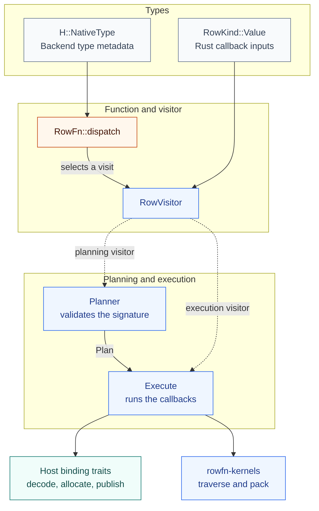

<!-- SPDX-License-Identifier: Apache-2.0 -->
<!-- SPDX-FileCopyrightText: Copyright the Vortex contributors -->

# Architecture

[Overview](../README.md) · [Rust interfaces](INTERFACES.md)

A function selects typed work through `RowVisitor`. Planning checks that selection. Execution runs
it through the host bindings. Types describe the values and metadata passed across those interfaces.

## The components

`Planner` and `Execute` are private implementations of `RowVisitor`. The diagram separates their
responsibilities, rather than listing every call. Both use host capabilities. Planning does not
decode inputs or run row callbacks.

| Part | Owns |
| --- | --- |
| `RowKind` | The Rust input value family, such as `i64`, `&str`, or `&[f64]`. |
| `RowFn` | Semantic dispatch, preparation callbacks, and row operations. |
| `RowVisitor` | The typed interface for owned, sink, prepared, deferred, and Boolean visits. |
| `Planner` / `Plan` | Signature validation, output metadata, and execution policy. |
| `Execute` | Constant handling, traversal, nulls, and eligible retries. |
| Host bindings | Native types, decoded owners, allocation, validity, and publication. |

## One successful batch

Execution repeats the function's dispatch with an execution visitor. Decoded owners remain alive
through preparation and traversal. Concrete text bindings select physical storage before the loop.
Empty, all-null, and retry paths can take different routes.

Only rejected deferred row evidence can trigger a null-based retry. Decoder and allocation failures
remain terminal. Preparation belongs to the invocation and can run again during a retry.

## Source map

| Location | Contains |
| --- | --- |
| [`rowfn-functions`](../rowfn-functions/README.md) | Shared definitions and optional domain mappings. |
| [`rowfn`](README.md) | Types, visitors, planning, execution, and sinks. |
| [`rowfn-kernels`](../rowfn-kernels/README.md) | Lane sources, borrowed bitmaps, and Boolean packing. |
| [`rowfn-arrow`](../rowfn-arrow/README.md) | Arrow bindings and invocation. |
| [`rowfn-examples`](../rowfn-examples/README.md) | Function examples and benchmarks using the included backend. |

The framework and kernels have no backend dependency. Registration and whole-batch functions remain
backend concerns. [Backends](BACKENDS.md) lists current and potential integrations.
