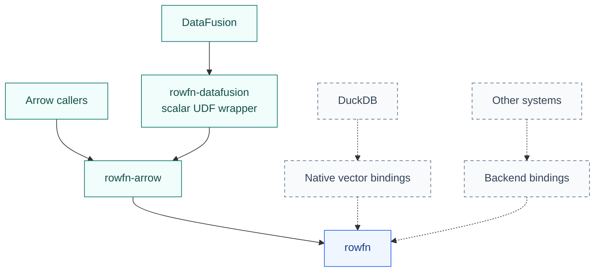

<!-- SPDX-License-Identifier: Apache-2.0 -->
<!-- SPDX-FileCopyrightText: Copyright the Vortex contributors -->

# Backends

[Overview](../README.md) · [Add a backend](ADAPTERS.md)

A backend binds RowFn to a columnar system. It owns native storage and metadata, while functions
and typed traversal remain shared.

| System | Status |
| --- | --- |
| [Arrow](../rowfn-arrow/README.md) | Included backend for direct array invocation. |
| [DataFusion](../rowfn-datafusion/README.md) | Experimental scalar UDF integration over Arrow. |
| DuckDB | Potential native vector backend. Not implemented. |
| Vortex | Earlier prototype preserved in [integrations/vortex](../integrations/vortex/README.md), outside the active workspace. |

See [status and verification](../STATUS.md) for the evidence behind these implementations.

## Integration boundaries

Dashed arrows show paths that have not been implemented in this workspace.

**DataFusion** registers `RowFnUdf` through its scalar UDF interface and delegates planning and
execution to `rowfn-arrow`. The wrapper retains fields, scalar markers, and logical row counts.
It owns signatures, volatility, registration identity, and error mapping. DataFusion 55.1.0 resolves
with the pinned Arrow 59.3.0. Custom coercion, optimizer rules, and broader catalog integration remain
outside this adapter. See its [contract and example](../rowfn-datafusion/README.md).

**DuckDB** could lend typed views over its [native data chunks](https://duckdb.org/docs/current/clients/c/data_chunk)
and publish into DuckDB-owned output. The backend would define supported vector representations,
validity, allocation, errors, and buffer lifetimes.

Other systems can implement the same [binding traits](INTERFACES.md). Any FFI must cross at a batch
boundary. Rust traits are not a stable binary ABI, and exchanging arrays does not define function
registration or invocation.
