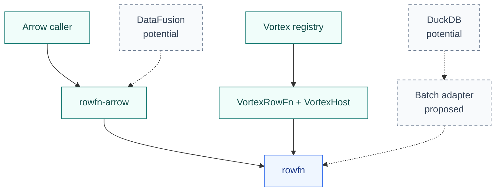

<!-- SPDX-License-Identifier: Apache-2.0 -->
<!-- SPDX-FileCopyrightText: Copyright the Vortex contributors -->

# Backends

[Overview](../README.md) · [Architecture](ARCHITECTURE.md)

Arrow is in the standalone workspace. Vortex is preserved as an integration snapshot. DataFusion and DuckDB are potential
integrations. Solid arrows below show existing invocation paths. Dashed arrows show proposals.

| Backend | Status | Boundary |
| --- | --- | --- |
| [Arrow](../rowfn-arrow/README.md) | Implemented, with latest changes unverified. | Fields, explicit scalar operands, and Arrow arrays. |
| [Vortex](../integrations/vortex/adapter/mod.rs) | Preserved integration snapshot, with latest changes unverified. | Native arrays, execution context, and existing function registry. |
| DataFusion | Potential. | A UDF wrapper over `rowfn-arrow`. |
| DuckDB | Potential. | Native vector bindings with a batch invocation boundary. |

## DataFusion: reuse Arrow bindings

DataFusion scalar UDFs receive columnar arguments and can return Arrow arrays. A RowFn wrapper could
use that existing boundary and delegate execution to `rowfn-arrow`. See the
[DataFusion UDF interface](https://datafusion.apache.org/library-user-guide/functions/adding-udfs.html).

The wrapper would still own registration, signatures, coercion, scalar markers, output metadata,
and error mapping. Its Arrow version must match the adapter. No wrapper has been implemented.

## DuckDB: bind batches of vectors

DuckDB exposes native vectors through its [data chunk interface](https://duckdb.org/docs/current/clients/c/data_chunk).
A RowFn adapter could retain a chunk, lend typed views, and publish into DuckDB-owned output.

The adapter must define supported vector representations, validity, allocation, errors, and buffer
lifetimes. Any C/Rust boundary must carry a whole batch, rather than call Rust for every row.
Rust traits are not a stable binary ABI. Arrow C Data could exchange arrays, but would not define
function registration or invocation by itself. No DuckDB adapter or ABI has been implemented.

Both integrations must preserve RowFn's strict null contract. Functions that need whole-batch access
or custom null behavior can remain on the host's broader function interface.
