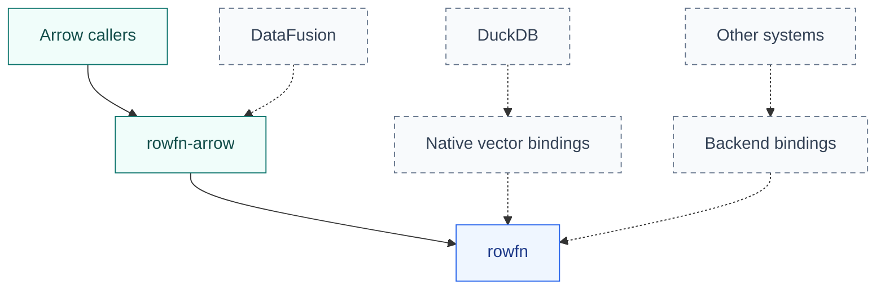

<!-- SPDX-License-Identifier: Apache-2.0 -->
<!-- SPDX-FileCopyrightText: Copyright the Vortex contributors -->

# Backends

[Overview](../README.md) · [Add a backend](ADAPTERS.md)

A backend binds RowFn to a columnar system. It owns native storage and metadata, while functions
and typed traversal remain shared.

| System | Status |
| --- | --- |
| [Arrow](../rowfn-arrow/README.md) | Included backend. Latest changes have source review only. |
| DataFusion | Potential integration over the Arrow backend. Not implemented. |
| DuckDB | Potential native vector backend. Not implemented. |
| Vortex | Earlier prototype preserved in [integrations/vortex](../integrations/vortex/README.md), outside the active workspace. |

## Possible integrations

Dashed arrows show paths that have not been implemented in this workspace.

**DataFusion** could register a UDF wrapper and delegate execution to `rowfn-arrow`. The wrapper
would own signatures, coercion, scalar markers, metadata, and error mapping. Its Arrow version must
match the backend. See the [UDF interface](https://datafusion.apache.org/library-user-guide/functions/adding-udfs.html).

**DuckDB** could lend typed views over its [native data chunks](https://duckdb.org/docs/current/clients/c/data_chunk)
and publish into DuckDB-owned output. The backend would define supported vector representations,
validity, allocation, errors, and buffer lifetimes.

Other systems can implement the same [binding traits](INTERFACES.md). Any FFI must cross at a batch
boundary. Rust traits are not a stable binary ABI, and exchanging arrays does not define function
registration or invocation.
