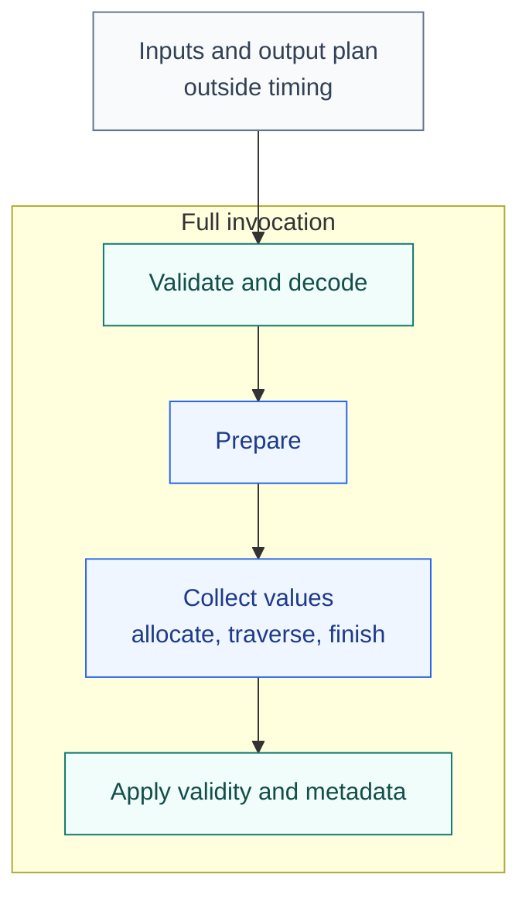

<!-- SPDX-License-Identifier: Apache-2.0 -->
<!-- SPDX-FileCopyrightText: Copyright the Vortex contributors -->

# Comparing implementations

[Overview](../README.md) · [Measurements](../BENCHMARKS.md)

Compare the same operation and data before comparing runtime. Agreement on a fixture is useful
evidence, but neither implementation is a correctness oracle or a performance limit.

## Match the contract

Match arithmetic, nulls, errors, output types, ownership, scalar markers, and metadata. Test empty
batches, slices, valid-row failures, and null payloads separately. Keep an obvious reference for any
optimized shortcut. A mismatch needs investigation, not a changed expected result.

A native kernel, a composition of kernels, and a handwritten reference are different baselines.
Name the one used. Different output layouts or error rules must be stated even when values agree.

## Choose the boundary



Collection controls measure allocation, traversal, and storage publication. Full invocation also
includes the surrounding work. Its ratio alone cannot identify row-loop overhead.

For a useful comparison:

- Report absolute time per batch, batch sizes, and ratios.
- Match compiler, target features, allocator, CGU count, LTO, and Cargo profiles.
- Preserve the 16-CGU, no-LTO comparison when investigating Boolean retry.
- Repeat runs serially, vary order, and retain raw results.
- Vary input distributions, null density, and pattern cardinality.
- Keep successful checked arithmetic separate from valid-row failures.

Do not combine timings from different machines or infer vectorization from a ratio. Compiler
explanations need the exact generated code that was timed.

## Use the current harness

The [Arrow fixture package](../rowfn-examples/README.md) compares direct collection, shared
collection, full invocation, and native kernels. The [DataFusion fixtures](../rowfn-datafusion/README.md#benchmark-boundaries)
compare direct Arrow calls, UDF wrapper invocation, and native DataFusion operations.

These reference commands select one Arrow behavior test and benchmark boundaries:

```sh
cargo test --locked -p rowfn-examples --test text_layouts
cargo bench --locked -p rowfn-examples --bench arrow_families -- ByteLengthUtf8
cargo bench --locked -p rowfn-examples --bench boundaries -- text_length_collection
cargo bench --locked -p rowfn-datafusion --bench boundaries
```

The final argument filters benchmark names. Keep both sides of a pair. Record the command, compiler,
target, environment, fixture, raw results, and source state, including uncommitted changes.
Verification remains opt-in. See [status and verification](../STATUS.md) for executed checks.

## Read existing evidence

[Benchmark measurements](../BENCHMARKS.md) links reports, timings, metadata, and source snapshots.
They describe earlier code, not the current export. Backend-specific qualifications belong with
each report. The [Arrow backend](../rowfn-arrow/README.md#native-comparisons) lists the current
fixture differences, and the [Vortex snapshot](../integrations/vortex/README.md) preserves earlier
cross-host work.
