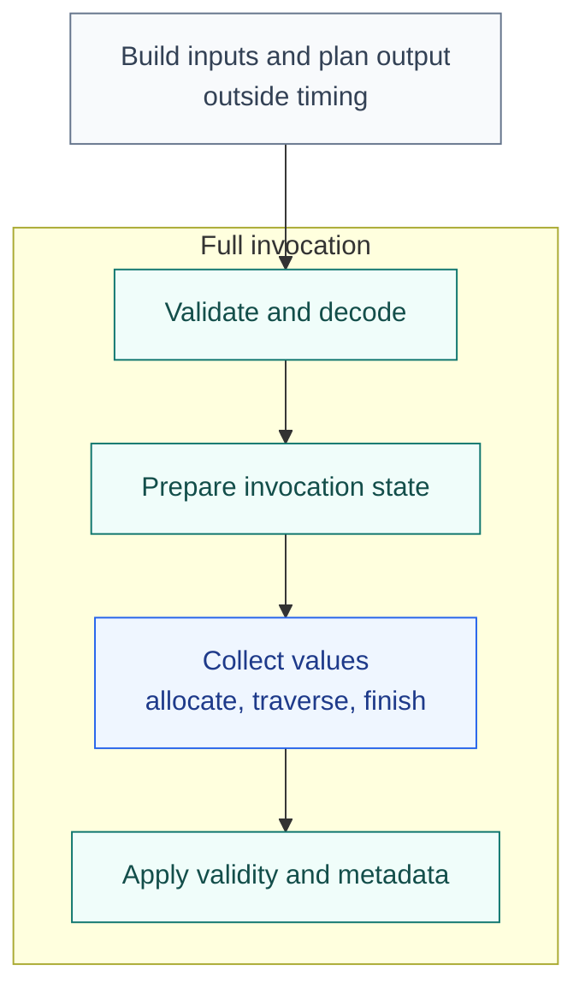

<!-- SPDX-License-Identifier: Apache-2.0 -->
<!-- SPDX-FileCopyrightText: Copyright the Vortex contributors -->

# Comparing an Arrow kernel with RowFn

[Overview](../README.md) · [Architecture](ARCHITECTURE.md)

Use RowFn as another implementation of a specific operation. First compare the results, then
investigate the time. Agreement is useful evidence, but neither implementation is a correctness
oracle or a performance upper bound.

## Match the operation

State the arithmetic rules, null behavior, errors, output type, and ownership before comparing.
Also match scalar markers, string layout, list shape, and semantic metadata. A length-one array
is not an implicit scalar. The [adapter guide](ADAPTERS.md) describes these binding contracts.

The fixtures compare values and nulls before timing. They do not exhaustively test errors or
metadata. Test empty batches, nulls, slices, scalars, and valid-row failures separately. For an
optimized shortcut, keep an obvious scalar reference that does not use the same shortcut.
Disagreement needs investigation against the contract, rather than a new expected result.

<details>
<summary>Contract differences in the existing fixtures</summary>

- Substring fixtures compare logical strings. Arrow returns `Utf8`, while RowFn returns owned
  `Utf8View`. Some sink baselines copy into `Utf8View` to match ownership.
- Dictionary baselines materialize logical rows on both paths. Null dictionary values and unused
  entries need separate coverage.
- Strict RowFn suppresses row failures when any input is null. Arrow 59.3.0 byte substring can report
  invalid boundaries in null payloads, and scalar regex can reject a pattern on all-null text.
- Error diagnostics are not automatically identical. Decoder, allocation, and validation failures
  remain terminal even when row errors can be suppressed.
- Floating comparisons use Arrow's total ordering. NaNs and signed zero need explicit fixtures.
- List width, child nullability, timestamp units, timezone, and extensions are part of the input
  contract. Compare output fields and retain string results after dropping their inputs.

</details>

## Measure the right boundary



Collection controls time allocation, traversal, and storage publication. Full invocation includes
the surrounding work, so its ratio cannot isolate row-loop overhead. Report absolute time per batch
and batch-size scaling.

| Question | Harness |
| --- | --- |
| What does shared collection add to a direct loop? | `boundaries`, including matched text-length allocation. |
| How does a full Arrow invocation compare with a native kernel? | `arrow_families` and `arrow_scalar`. |
| What changes with strings, dictionaries, lists, or scalars? | `arrow_workloads`, with baseline qualifications. |
| What does the Vortex adapter add? | `host_comparison` and `boundaries` in this modified checkout. |

For a matched comparison:

- Use the same compiler, target features, allocator, CGU count, LTO mode, and Cargo profiles.
- Preserve dependency overrides and the 16-CGU, no-LTO Boolean retry comparison.
- Run serially and vary comparison order.
- Retain distributions and raw results, not only the fastest sample.

Pattern complexity and cardinality can change preparation and memory costs. Successful checked
arithmetic and valid-row failures exercise different paths. A small-batch percentage can reflect
fixed invocation work. Do not combine ARM and x86 timings or infer vectorization from a ratio.
Compiler explanations need the exact generated code that was timed.

## Run a focused comparison

These are reference commands from the current workspace. They have not run for the latest changes.

```sh
cargo run --locked -p rowfn-functions --features arrow --example arrow
cargo test --locked -p rowfn-arrow --test text_bindings
cargo test --locked -p rowfn-arrow --test invocation
```

The following pairs use the independent Arrow fixture package. The final argument filters
benchmark names. Full Vortex and cross-host fixtures are preserved under `integrations/vortex`.

```sh
cargo test --locked -p rowfn-examples --test text_layouts
cargo bench --locked -p rowfn-examples --bench arrow_families -- ByteLengthUtf8
cargo bench --locked -p rowfn-examples --bench boundaries -- text_length_collection
```

Keep both native and RowFn cases in a comparison. Record the command, compiler, target, environment,
fixture, raw results, and source state, including uncommitted changes.

## Read the recorded results

The [full comparison](../research/row-fn-engine/compute-options.md) includes wins and losses.
The [Arrow investigation leads](../research/row-fn-engine/arrow-performance-opportunities.md) link
to their raw evidence. They describe Arrow 59.3.0 and earlier RowFn source, not current Arrow mainline.

The package split, concrete text dispatch, and rename remain unbuilt, untested, and unbenchmarked.
Historical scripts retain their original names and source assumptions. The unsafe Vortex UTF-8
experiment skipped validation and null sanitation and is separate from the Arrow paths. See the
[implementation record](../research/row-fn-engine/implementation.md) and [safety record](SAFETY.md).
