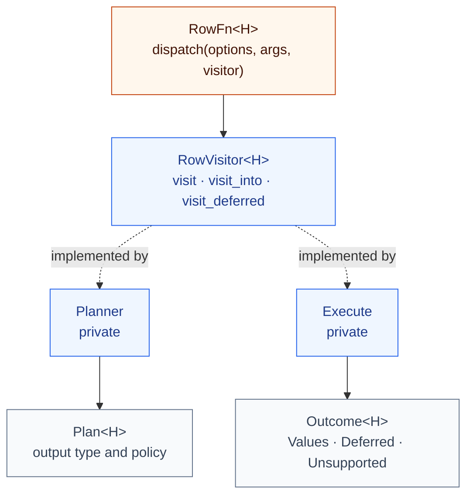
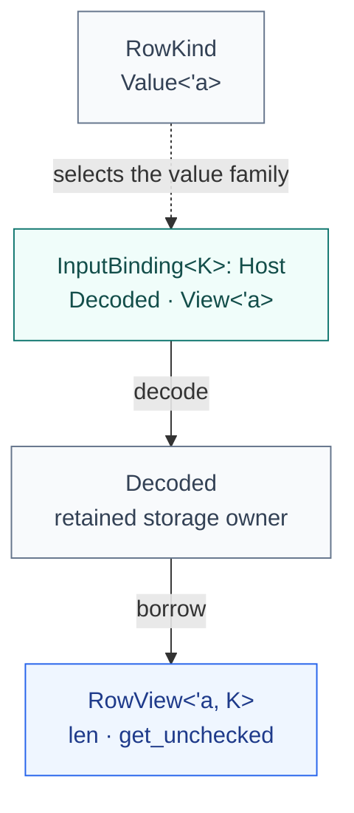
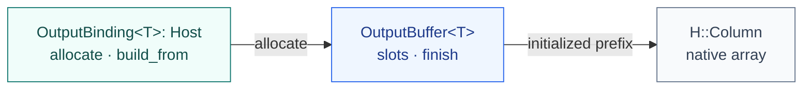

<!-- SPDX-License-Identifier: Apache-2.0 -->
<!-- SPDX-FileCopyrightText: Copyright the Vortex contributors -->

# Rust interfaces

[Overview](../README.md) · [Architecture](ARCHITECTURE.md)

These diagrams use the actual API names. Generic arguments are shown where they help. Only selected
methods are listed. Source links contain the full contracts.

These are the standalone interfaces. Vortex's [API tracking issue](https://github.com/vortex-data/vortex/issues/9129)
documents the related Vortex interface and its design history.

## 1. Select typed work



[`RowFn` and `RowVisitor`](src/visitor.rs) are public traits. [`Planner`](src/plan.rs) returns a
`Plan<H>` without running callbacks. [`Execute`](src/execute/visitor.rs) returns an internal
`Outcome<H>`. The public `execute` function checks the plan and ultimately returns `H::Column`.

<details>
<summary>Dispatch and owned-output signatures</summary>

```rust,ignore
// Selected members of RowFn<H> and RowVisitor<H>.
fn dispatch<V: RowVisitor<H>>(
    &self,
    options: &Self::Options,
    args: &[H::NativeType],
    visitor: V,
) -> HostResult<H, V::VisitResult>;

fn visit<Args, Out>(
    self,
    apply: impl Fn(Args::Elems<'_>) -> Out,
) -> HostResult<H, Self::VisitResult>
where
    Args: InputTuple<H>,
    Out: Default + 'static,
    H: OutputBinding<Out>;
```

</details>

## 2. Borrow typed input



[`InputBinding`](src/input.rs) retains the decoded owner and lends a `RowView`. The view returns
`K::Value<'a>` and cannot outlive its owner. `i64` lends a value, `Utf8` lends `&str`, and
`FixedSizeList<f64>` lends `&[f64]`. A row kind does not describe the native array layout.

`RowView` is unsafe to implement. Every in-range read must return a valid value, including reads at
null slots after decoding. Bounds and ownership requirements are in its source contract.

## 3. Allocate and finish output



[`OutputBinding`](src/output.rs) chooses storage whose `Finished` type is `H::Column`.
`OutputBuffer` is unsafe to implement. Slot contents must remain stable, partial initialization must
be safe to abandon, and `finish` may read only the initialized prefix.

<details>
<summary>Borrowed views and finished-output associated types</summary>

```rust,ignore
trait RowKind: 'static {
    type Value<'a>;
}

// Selected members of InputBinding<K>.
trait InputBinding<K: RowKind>: Host {
    type Decoded: 'static;
    type View<'a>: RowView<'a, K>;

    fn view(decoded: &Self::Decoded) -> Self::View<'_>;
}

// Selected members of OutputBinding<T>.
trait OutputBinding<T: Default + 'static>: Host {
    type Buffer: OutputBuffer<T, Finished = Self::Column> + 'static;
}
```

</details>

## Backend types

Every backend defines `Column`, `NativeType`, `Context`, and `Error` through [`Host`](src/host.rs).
Binding traits supply the operations. The executor uses those types without requiring one array
layout or type system.

<details>
<summary>Included Arrow bindings and the earlier Vortex prototype</summary>

| Type | [`ArrowHost`](../rowfn-arrow/src/lib.rs) | [`VortexHost`](../integrations/vortex/adapter/mod.rs) |
| --- | --- | --- |
| `Column` | Arrow `ArrayRef`. | Vortex `ArrayRef`. |
| `NativeType` | `Field`. | `DType`. |
| `Context` | `()`. | `ExecutionCtx`. |
| `Error` | `ArrowError`. | `VortexError`. |

The `i64` bindings retain different storage and lend the same Rust input view:

| Binding | [Arrow](../rowfn-arrow/src/input.rs) | [Vortex](../integrations/vortex/adapter/input.rs) |
| --- | --- | --- |
| `Decoded` | `ScalarBuffer<i64>`. | `Buffer<i64>`. |
| `View<'a>` | `&'a [i64]`. | `&'a [i64]`. |
| Output `Buffer` | [`PrimitiveOutput<i64>`](../rowfn-arrow/src/output.rs). | [`VortexBuffer<i64>`](../integrations/vortex/adapter/output.rs). |

</details>

Other interfaces have focused jobs: [`TypeBinding` and `BatchBinding`](src/host.rs) handle metadata
and batch operations, [`OutputSink`](src/sink/mod.rs) lends writable rows, and
[`BooleanOutput`](src/output.rs) packs Boolean results. See the [adapter guide](ADAPTERS.md) for
those contracts and the [safety record](SAFETY.md) for their invariants.
